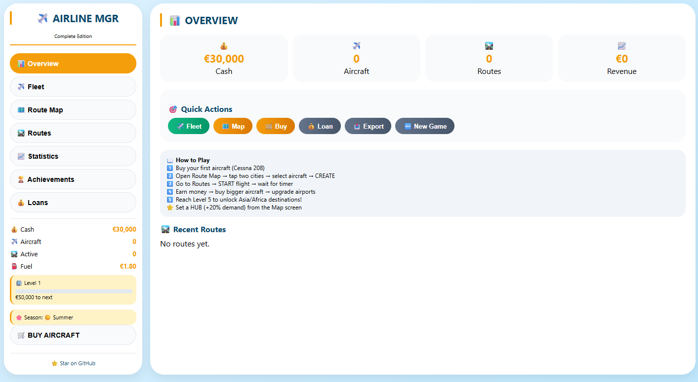
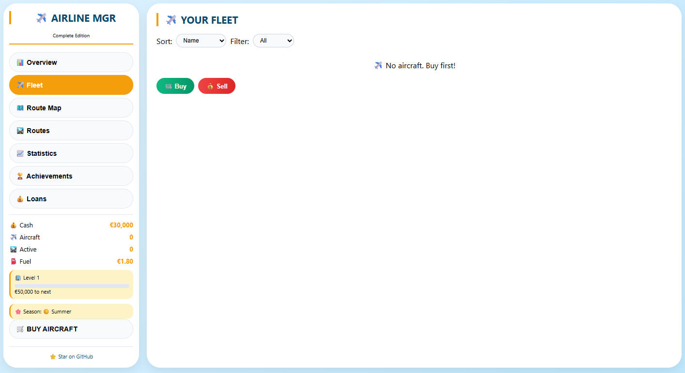
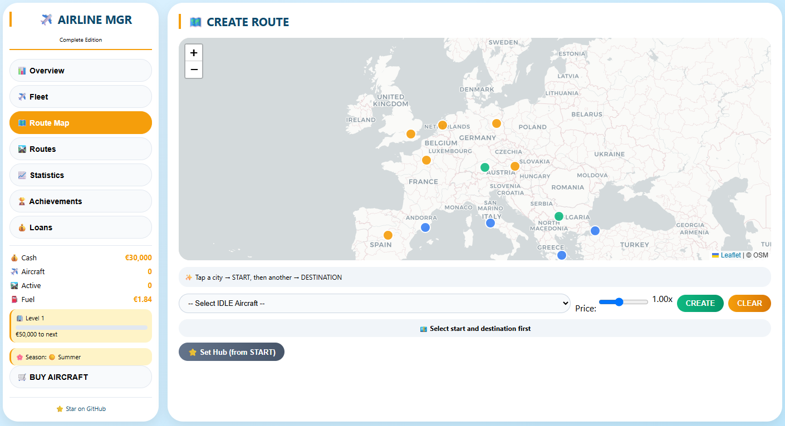
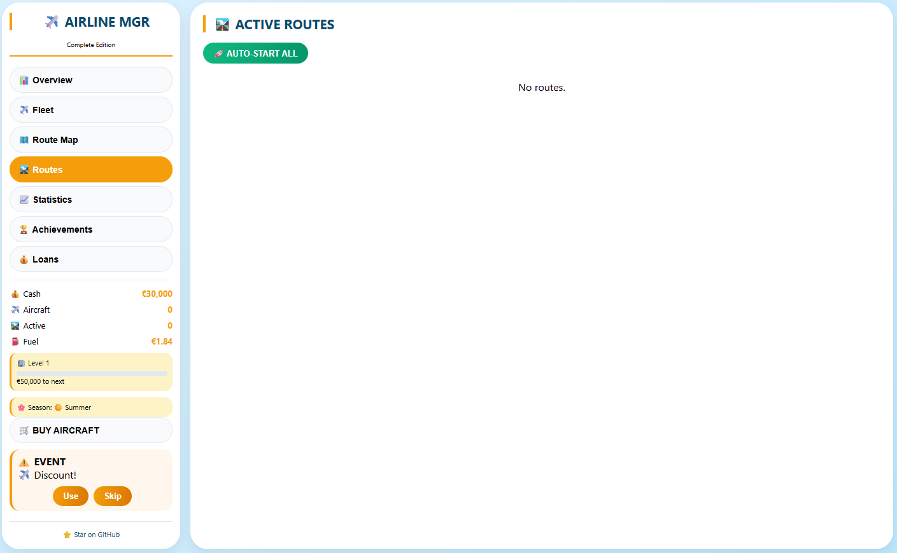
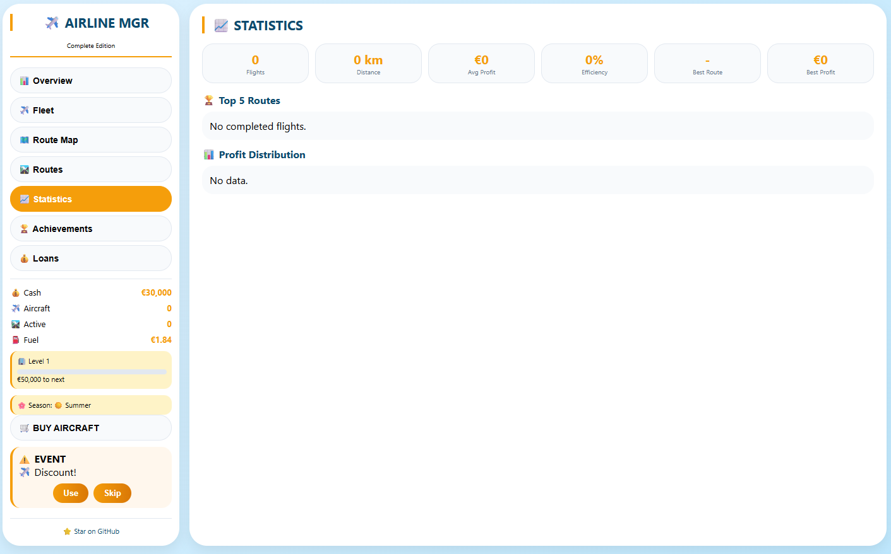
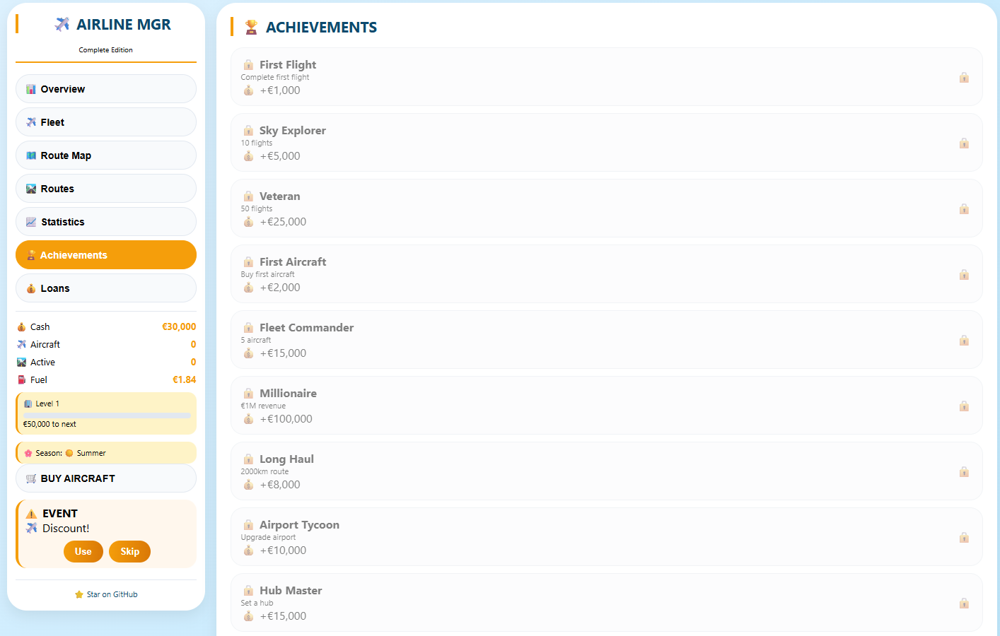

# ✈️ Airline Manager - Complete Edition

[](https://opensource.org/licenses/MIT)
[](https://developer.mozilla.org/en-US/docs/Web/JavaScript)
[](https://web.dev/progressive-web-apps/)

A complete browser-based airline tycoon simulation game where you build and manage your own airline empire.

**[Play Now!](https://nikolagogov.github.io/airline-manager-tycoon/)**

---

## 🎮 Features

| Feature | Description |
|:--------|:------------|
| ✈️ **Real-time Flights** | Flights take real time (20-120 seconds). Watch timers count down! |
| 💰 **Dynamic Economy** | Demand decays with frequency, recovers over time. Seasonal bonuses affect different city types. |
| 🏗️ **Airport Upgrades** | Expand slot capacity at any airport for a cost. |
| ⭐ **Hub System** | Designate a hub city for +20% demand bonus on all departing routes. |
| 🔧 **Maintenance** | After 10 flights, aircraft need maintenance (pay or wait 30 seconds). |
| 🌍 **Global Expansion** | Reach Company Level 5+ to unlock destinations in Asia & Africa! |
| 🏆 **Achievements** | Unlock 10+ achievements with cash rewards. |
| 📊 **Statistics** | Track flights, distance, best routes, fleet efficiency. |
| 💵 **Loans** | Voluntary or emergency loans with 50% profit repayment. |
| ☁️ **Cloud Save** | Auto-saves to localStorage. Export/Import support. |
| 📱 **Mobile Optimized** | Touch-friendly interface with responsive design. |
| 🔄 **PWA Installable** | Add to homescreen and play offline! |

---

## 🖼️ Screenshots

| Overview | Fleet | Route Map |
|:--------:|:-----:|:---------:|
|  |  |  |

| Routes | Statistics | Achievements |
|:------:|:----------:|:------------:|
|  |  |  |

---

## 🎯 How to Play

1. **Buy your first aircraft** – Start with the Cessna 208 (€25,000)
2. **Open Route Map** – Tap a departure city, then a destination
3. **Select an aircraft** – Choose from your IDLE fleet
4. **Set price multiplier** – Higher prices = fewer passengers
5. **Create Route** – Pay the airport fee
6. **Go to Routes screen** – Click START on any ready route
7. **Wait for completion** – Earn profit when flight lands!
8. **Reinvest** – Buy bigger aircraft, upgrade airports, set a HUB

### Strategy Tips

- **Small aircraft** (Cessna, ATR) → Easy to fill, good for low-demand routes
- **Large aircraft** (Boeing, Airbus) → Massive profit potential, but hard to fill on niche routes
- **Set a HUB early** – +20% demand from your main hub city is huge!
- **Watch fuel prices** – They fluctuate ±15% every 90 seconds
- **Maintenance costs** – Heavy aircraft cost €8,000; Light cost €3,000
- **Level up** – Every €50k–€15M revenue increases company level
- **Unlock new cities** – Dubai, Bangkok, Singapore, Cairo, Johannesburg appear at Level 5+

---

## 🛠️ Technologies Used

- **HTML5 / CSS3** – Animations, responsive design, Flexbox/Grid
- **JavaScript (ES6+)** – Game logic, state management, localStorage
- **Leaflet.js** – Interactive map with OpenStreetMap tiles
- **PWA** – Manifest + Service Worker for offline capability

---

## 📦 Installation

### Play Online
Visit [https://nikolagogov.github.io/airline-manager-tycoon/](https://nikolagogov.github.io/airline-manager-tycoon/)

### Run Locally
```bash
git clone https://github.com/nikolagogov/airline-manager-tycoon.git
cd airline-manager-tycoon
# Just open index.html in your browser
# Or use any local server (Live Server, Python HTTP Server, etc.)

### Install as PWA
1. Open the game in Chrome/Edge/Safari
2. Click the "Install" icon in the address bar (or "Add to Home Screen")
3. Play offline!

---

## 🎓 Game Progression

| Level | Revenue Required | Unlocks |
|:-----:|:----------------|:--------|
| 1 | Start | Europe cities |
| 2 | €50,000 | – |
| 3 | €200,000 | – |
| 4 | €500,000 | – |
| 5 | €1,000,000 | ✨ Dubai, Bangkok, Singapore, Cairo ✨ |
| 6 | €2,000,000 | ✨ Johannesburg ✨ |
| 7 | €4,000,000 | – |
| 8 | €7,000,000 | – |
| 9 | €10,000,000 | – |
| 10 | €15,000,000 | – |

---

## 🚀 Future Plans

- [ ] Daily challenges / Contracts
- [ ] Aircraft upgrades (fuel efficiency, range, capacity)
- [ ] Cargo routes (higher profit, lower demand)
- [ ] Leaderboards (local for now, online later)
- [ ] More regions (North America, South America)

---

## 🤝 Contributing

Issues and pull requests are welcome! For major changes, please open an issue first.

---

## 📄 License

MIT License – Free for personal and commercial use.

---

## 🙏 Credits

- Map tiles by [CartoDB](https://carto.com/) and [OpenStreetMap](https://openstreetmap.org)
- Icons: Emoji (cross-platform)
- Inspired by classic tycoon games

---

**⭐ Star this repo if you enjoy the game!** ⭐

Made with ❤️ using vanilla JavaScript